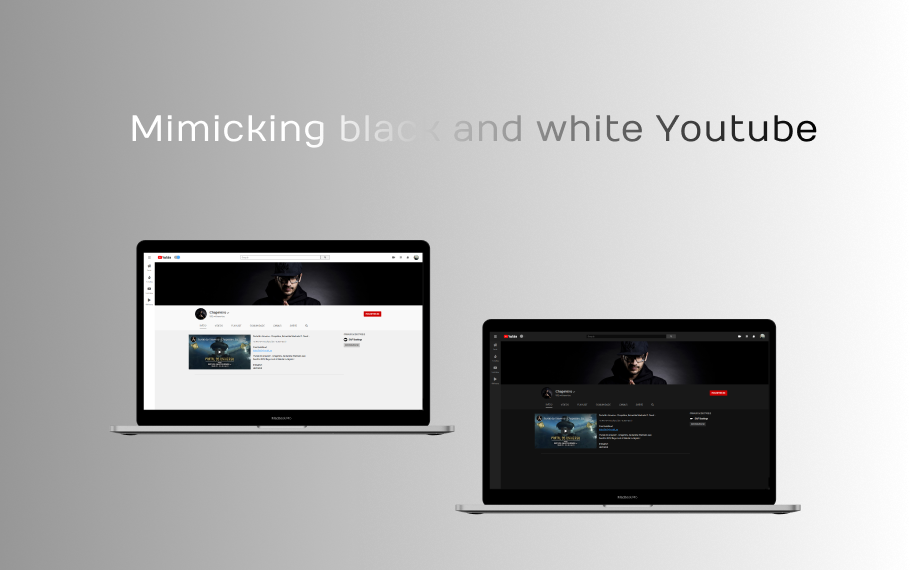

# Project:  **Lookalike Youtube Channel** 
> Using Flexbox / Grid and SASS

## **Disclaimer**: 
1. This was an exercise from **DCI's WEB Development Course**, which I attended between 2019 - 2021. 
2. This project is just for learning purpose. 

### 🚀 Technologies used

## ROADMAP
#### The mainly tasks were: 
- [x] Header
- [x] Sidebar
- [x] Profile Info
- [x] Profile Navigation
- [x] Featured Channels
- [x] Dark / Light Mode.
